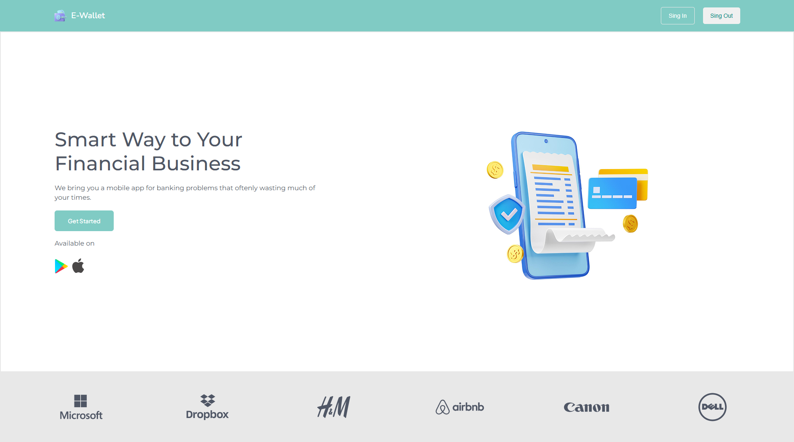

# Slicing Project
This project is related to the implementation of slicing with a total of 16 pages and with responsive pages. This project tends to document more HTML and CSS structures for further use.

## Preview
Check out this project: [E-Wallet](https://yusufbahtiarr.github.io/fgo24-css-slicing/)  



## How to Run this project

1. Clone this project
```
git clone https://github.com/yusufbahtiarr/fgo24-css-slicing.git
```
2. Enter the project directory
```
cd fgo24-css-slicing.git
```
3. Install the Depedencies
```
npm install
```
4. Run the project
```
npm run dev
```
5. Project will running on http://localhost:8080

## Dependencies

This project using nodejs to run, so make sure to install node on your machine.
- live-server: to mock http server in local environtment

## How to Contribute

Please open PR to contributed to this project, i will review and merge if its needed.

## License

This project following MIT License

